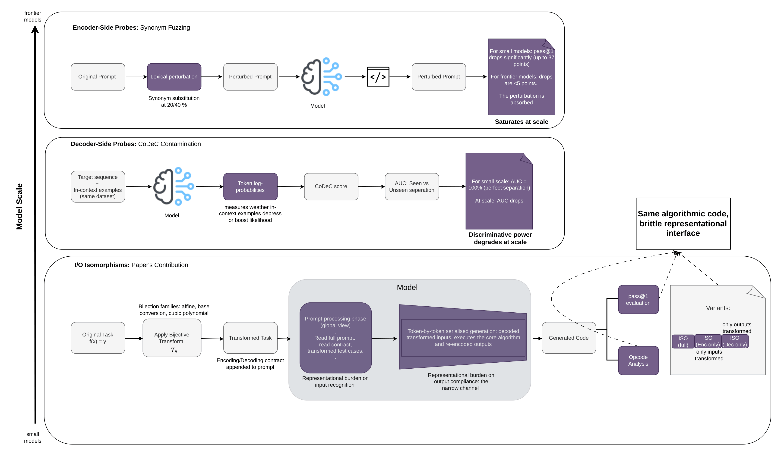
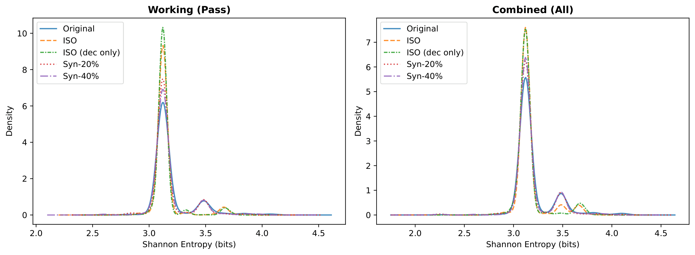
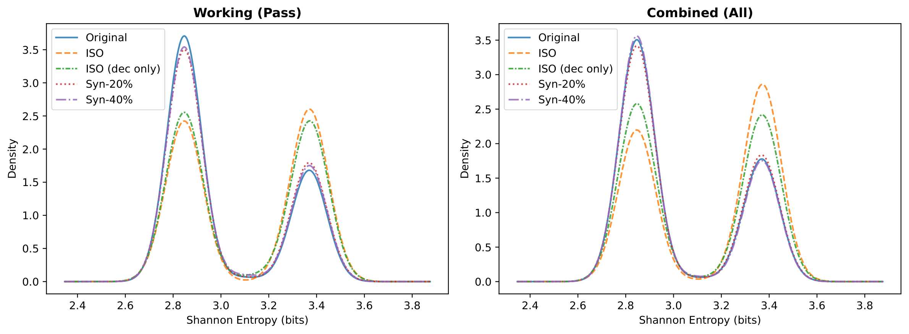
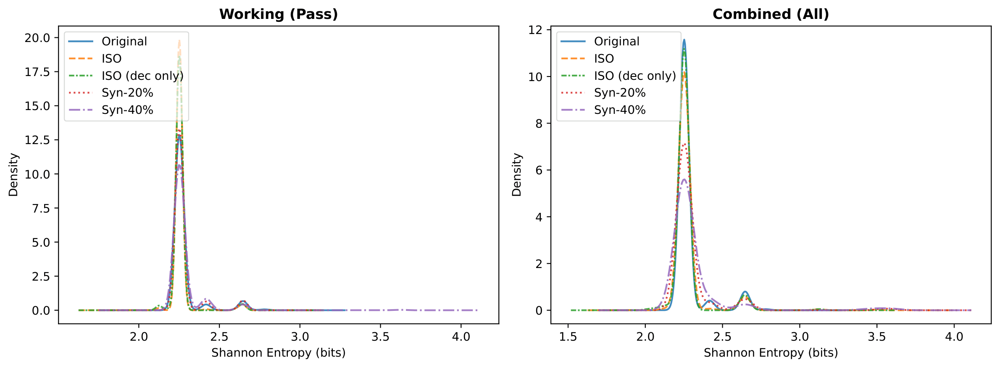
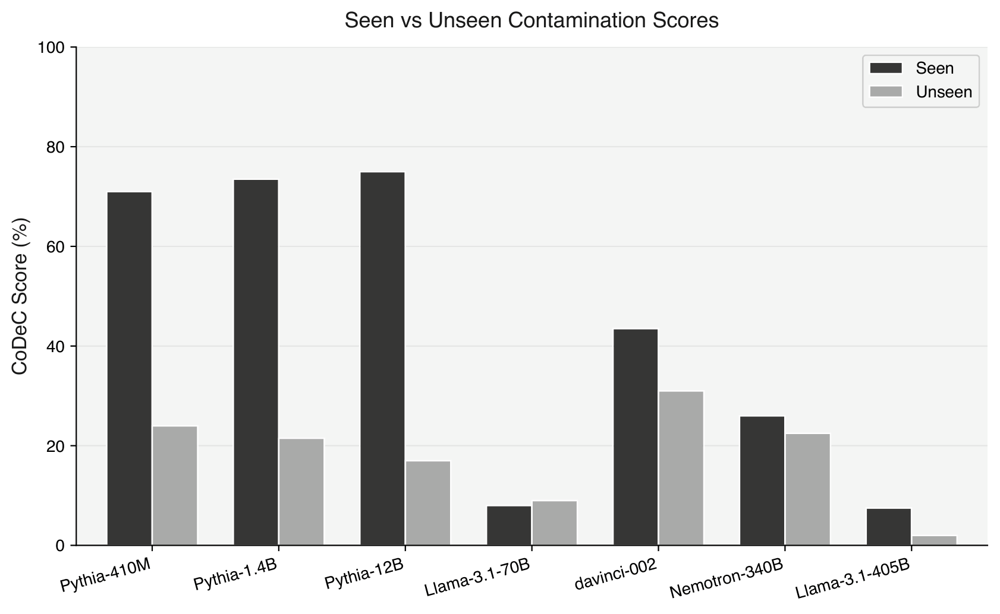
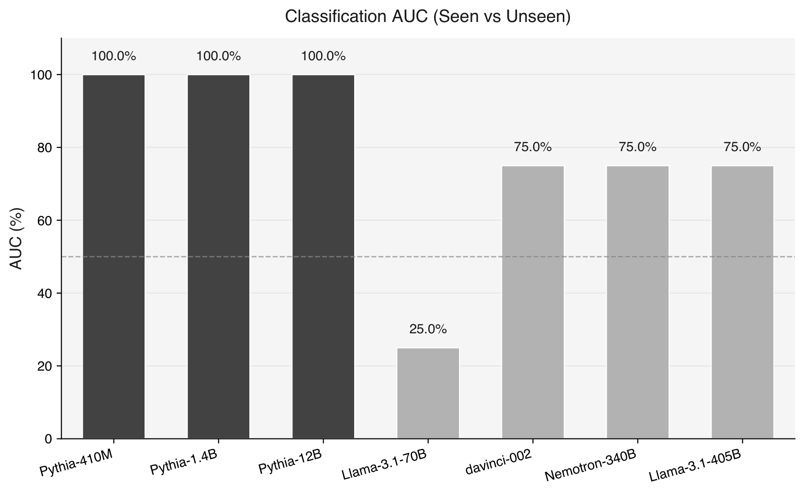

# Scaled Code LLMs Generalize through Narrow Channels

Replication package for evaluating memorization and generalization in code LLMs
using **I/O isomorphisms**, **encoder-side synonym fuzzing**, and **decoder-side
contamination probing (CoDeC)**.

<p align="center">
  
</p>

> We evaluate three diagnostic axes across model scale: encoder-side synonym
> fuzzing, decoder-side CoDeC contamination probing, and I/O isomorphisms with
> opcode analysis. The isomorphism preserves the algorithmic task exactly while
> isolating representational burden on both prompt processing and generation.

---

## Repository Structure

```
.
├── change_prompts/                 # Dataset transformation pipeline
│   ├── adapters/                   # BigOBench, EffiBench, MBPP adapters
│   ├── apply_isomorphisms.py       # Apply I/O isomorphisms to datasets
│   ├── contracts.py                # Encoding contract generation
│   ├── iso_transforms.py           # Affine, cubic, base-conversion transforms
│   └── prompt_fuzzing.py           # Synonym fuzzing and dead-code insertion
├── generation_and_testing/         # Code generation and evaluation
│   ├── gen_models.py               # Multi-backend generation (Gemini, OpenRouter, HuggingFace)
│   ├── run_unittests.py            # Execute test cases against generated code
│   ├── compute_pass_at_k.py        # Unbiased pass@k estimator
│   └── pipeline_generate_and_test.sh
├── opcode_analysis/                # Static opcode entropy and JSD divergence
│   ├── metric_ready.py             # Prepare generation+test data for analysis
│   ├── extract_opcodes.py          # Opcode distributions via dis, per-problem JSD
│   ├── compare_conditions.py       # JSD between orig and ISO opcode centroids
│   └── run_metrics.sh
├── codec/                          # CoDeC contamination probing
│   ├── experiment.py               # Core CoDeC experiment logic (token log-likelihoods)
│   ├── run_codec_scale_confirmation.py  # Run CoDeC across model scale axis
│   ├── compare_codec_results.py    # Aggregate results into comparison tables
│   ├── plot_codec_comparison.py    # Generate CoDeC figures
│   ├── utils.py                    # Gemini / tokenization / alignment helpers
│   └── requirements.txt
├── analyze_results/                # Aggregate statistics and tables
│   ├── bootstrap_ci.py             # 95% bootstrap CIs for pass@1 differences
│   └── gen_table_with_ci.py        # LaTeX table generation
├── datasets/                       # All benchmark variants (hosted on Zenodo)
├── figs/                           # Key figures
├── config.yaml                     # API keys (not committed)
└── requirements.txt
```

---

## Models

| Model                         | Params | Backend     | CLI key              |
|-------------------------------|--------|-------------|----------------------|
| deepseek-coder-6.7b-instruct | 6.7B   | HuggingFace | `deepseek-coder-6.7b`|
| Llama-3.1-8B-Instruct        | 8B     | HuggingFace | `llama-3.1-8b`       |
| CodeLlama-13B-Instruct       | 13B    | HuggingFace | `codellama-13b`      |
| StarCoder2-15B               | 15B    | HuggingFace | `starcoder2-15b`     |
| Codestral-22B-v0.1           | 22B    | HuggingFace | `codestral-22b`      |
| Qwen2.5-Coder-32B-Instruct   | 32B    | HuggingFace | `qwen2.5-coder-32b`  |
| Llama-3.1-70B-Instruct       | 70B    | HuggingFace | `llama-3.1-70b`      |
| gpt-4o-mini-2024-07-18       | ---    | OpenRouter  | `gpt-4o-mini`        |
| gpt-4o-2024-08-06            | ---    | OpenRouter  | `gpt-4o`             |
| gemini-2.0-flash             | ---    | Gemini API  | `gemini-2.0-flash`   |
| gemini-2.5-flash             | ---    | Gemini API  | `gemini-2.5-flash`   |

---

## Evaluation Conditions

| Condition          | Description                                           | CLI flag / folder suffix     |
|--------------------|-------------------------------------------------------|------------------------------|
| **Original**       | Unmodified benchmark                                  | `--original`                 |
| **ISO**            | Full I/O isomorphism (encode inputs + decode outputs) | (default)                    |
| **ISO (enc only)** | Only outputs encoded; inputs unchanged                | `--iso_enc_only`             |
| **ISO (dec only)** | Oracle-decoded inputs provided; outputs encoded       | `--iso_dec_only`             |
| **Syn-20%**        | 20% WordNet synonym substitution                      | `--fuzz synonym_20`          |
| **Syn-40%**        | 40% WordNet synonym substitution                      | `--fuzz synonym_40`          |

Ablation ISO families: `--iso_family affine_int` (default), `base_conv`, `cubic_int`.
Length control: `--fuzz deadcode`.

---

## Opcode Entropy KDE (Gemini-2.0-Flash)

Frontier models produce nearly identical opcode-entropy profiles under ISO and
Original conditions, demonstrating preserved algorithmic competence despite
substantial pass@1 drops.

<p align="center">
  
</p>
<p align="center"><em>BigOBench: entropy distributions overlap almost perfectly under ISO.</em></p>

<p align="center">
  
</p>
<p align="center"><em>EffiBench: same pattern — algorithmic core preserved, decoder fumbles the contract.</em></p>

<p align="center">
  
</p>
<p align="center"><em>MBPP: even on a contamination-likely benchmark, ISO and Original opcode profiles align.</em></p>

---

## CoDeC Contamination Probing

CoDeC measures how in-context examples shift token log-likelihoods to
distinguish seen from unseen training data. The signal degrades as model
scale grows.

<p align="center">
  
</p>
<p align="center"><em>Seen–unseen gap collapses from 58 pts (Pythia-12B) to 5.5 pts (Llama-3.1-405B).</em></p>

<p align="center">
  
</p>
<p align="center"><em>AUC drops from 100% at the Pythia scale to 75% at frontier scale.</em></p>

---

## Setup

```bash
pip install -r requirements.txt
```

Create `config.yaml`:

```yaml
api_key: "your-gemini-api-key"
openrouter_api_key: "your-openrouter-api-key"
hf_token: "your-huggingface-token"    # optional, for gated models
```

Download the datasets from Zenodo and place them under `datasets/`.

---

## Reproducing the Experiments

### Step 1: Generate Isomorphic Datasets

Transformed datasets are provided on Zenodo. To regenerate from scratch:

```bash
for DATASET in bigobench effibench mbpp; do
  # Affine isomorphism (all variants)
  python change_prompts/apply_isomorphisms.py \
    --dataset $DATASET --iso_family affine_int --seed 42
  python change_prompts/apply_isomorphisms.py \
    --dataset $DATASET --iso_family affine_int --seed 42 --oracle_help_inputs
  python change_prompts/apply_isomorphisms.py \
    --dataset $DATASET --iso_family affine_int --seed 42 --encode_only

  # Ablation families
  python change_prompts/apply_isomorphisms.py \
    --dataset $DATASET --iso_family base_conv --seed 42
  python change_prompts/apply_isomorphisms.py \
    --dataset $DATASET --iso_family cubic_int --seed 42

  # Synonym fuzzing
  python change_prompts/prompt_fuzzing.py --dataset $DATASET --mode synonym --fuzz_level 0.2
  python change_prompts/prompt_fuzzing.py --dataset $DATASET --mode synonym --fuzz_level 0.4

  # Dead-code insertion (length control)
  python change_prompts/prompt_fuzzing.py --dataset $DATASET --mode deadcode --num_blocks 3
done
```

### Step 2: Run All Models x All Conditions

```bash
for MODEL in gemini-2.0-flash gemini-2.5-flash gpt-4o gpt-4o-mini \
             deepseek-coder-6.7b llama-3.1-8b codellama-13b starcoder2-15b \
             codestral-22b qwen2.5-coder-32b llama-3.1-70b; do
  for DATASET in bigobench effibench mbpp; do
    # All 6 conditions
    ./generation_and_testing/pipeline_generate_and_test.sh \
      --dataset $DATASET --model $MODEL --original --resume
    ./generation_and_testing/pipeline_generate_and_test.sh \
      --dataset $DATASET --model $MODEL --resume
    ./generation_and_testing/pipeline_generate_and_test.sh \
      --dataset $DATASET --model $MODEL --iso_enc_only --resume
    ./generation_and_testing/pipeline_generate_and_test.sh \
      --dataset $DATASET --model $MODEL --iso_dec_only --resume
    ./generation_and_testing/pipeline_generate_and_test.sh \
      --dataset $DATASET --model $MODEL --fuzz synonym_20 --resume
    ./generation_and_testing/pipeline_generate_and_test.sh \
      --dataset $DATASET --model $MODEL --fuzz synonym_40 --resume
  done
done
```

### Step 3: ISO Family Ablation

```bash
for MODEL in gemini-2.0-flash codestral-22b qwen2.5-coder-32b; do
  for DATASET in bigobench effibench mbpp; do
    for FAMILY in base_conv cubic_int; do
      ./generation_and_testing/pipeline_generate_and_test.sh \
        --dataset $DATASET --model $MODEL --iso_family $FAMILY --resume
    done
  done
done
```

### Step 4: Dead-Code Length Control

```bash
for MODEL in gemini-2.0-flash codestral-22b llama-3.1-70b; do
  for DATASET in bigobench mbpp; do
    ./generation_and_testing/pipeline_generate_and_test.sh \
      --dataset $DATASET --model $MODEL --fuzz deadcode --resume
  done
done
```

### Step 5: Opcode Analysis

```bash
./opcode_analysis/run_metrics.sh \
  --model gemini-2.0-flash --datasets bigobench,effibench,mbpp
```

### Step 6: CoDeC Contamination Probing

```bash
cd codec
pip install -r requirements.txt

# Run across the full scale axis
python run_codec_scale_confirmation.py --models all \
  --seen-datasets hackernews,wikipedia \
  --unseen-datasets gpqa_diamond,livecodebench_v5

# Aggregate and plot
python compare_codec_results.py --results-dir results
python plot_codec_comparison.py --csv comparison.csv
```

### Step 7: Bootstrap CIs

```bash
python analyze_results/bootstrap_ci.py
```

---

## Transform Families

| Family               | CLI name     | Transform     | Inverse            |
|----------------------|--------------|---------------|--------------------|
| **Affine** (primary) | `affine_int` | x' = a·x + b | x = (x' − b) / a  |
| **Base conversion**  | `base_conv`  | Decimal→base-b| Base-b→decimal     |
| **Cubic polynomial** | `cubic_int`  | x' = x³ + c  | x = ∛(x' − c)     |
